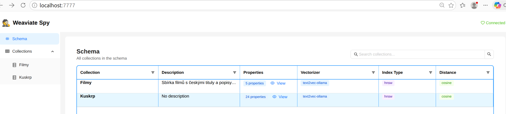
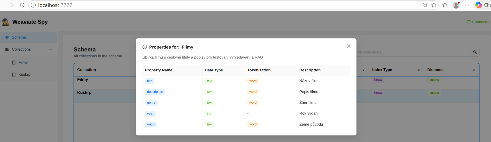
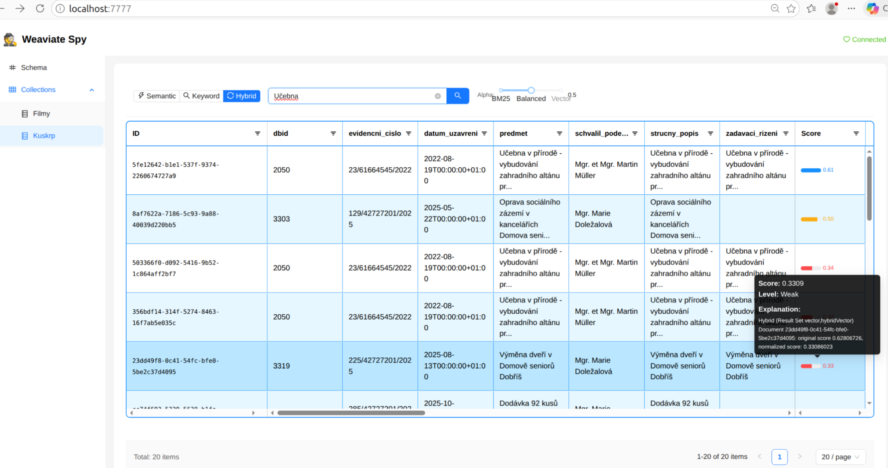

# Weaviate-Spy

Weaviate-Spy is a web client for exploring **local docker** [Weaviate Weaviate.io](https://weaviate.io/) vector database.


## Features

- **Health Check** - Monitor Weaviate connection status
- **Schema Browser** - View all collections and their properties
- **Collections Browser** - Browse and search collection data
  - **Aggregations** - Group and count by property
  - **Generative Search** - RAG with Ollama LLMs
    - **Semantic Search** - AI-powered near-text with certainty
    - **Keyword Search** - BM25 full-text search
    - **Hybrid Search** - Combine BM25 + vector with alpha

## Quick Start

```bash
# Clone the repository
git clone https://github.com/AISidesKicks/weaviate-spy.git
cd weaviate-spy

# Start the application - build container
docker compose up -d --build
```

Open http://localhost:7777 in your browser.

## Usage

See `compose.yml` and adjust environment variables as needed. By default it connects to a locally hosted (docker) Weaviate on port 8080 (without auth credentials).

## Dummy Data / Testing

See [`dummy/dummy.md`](dummy/dummy.md) for setting up test data with Weaviate and Ollama.

The dummy directory contains:
- `docker-compose.yml` - Weaviate + Ollama setup on Nvidia (RTX 4060 12GB VRAM)
- `ollama_test.sh` - Script to test Ollama models (embeding and generation)
- `weaviate_dummy.py` - Script to create sample Filmy collection and to test it

## More screenshots







## Inspiration

Original simple Web UI for Weaviate V3: [naaive/weaviate-ui](https://github.com/naaive/weaviate-ui)

## Disclaimer

This project is for educational purposes only and is not affiliated with or sponsored by [Weaviate](https://weaviate.io/) or [Ollama](https://ollama.com/). Use at your own risk.

**CAUTION:** There is no authorization or authentication in place in Weaviate Spy! Use only in trusted local environments.

## Contribution

Any form of contribution is welcome, including but not limited to submitting bug reports, proposing new features, improving code, etc.
