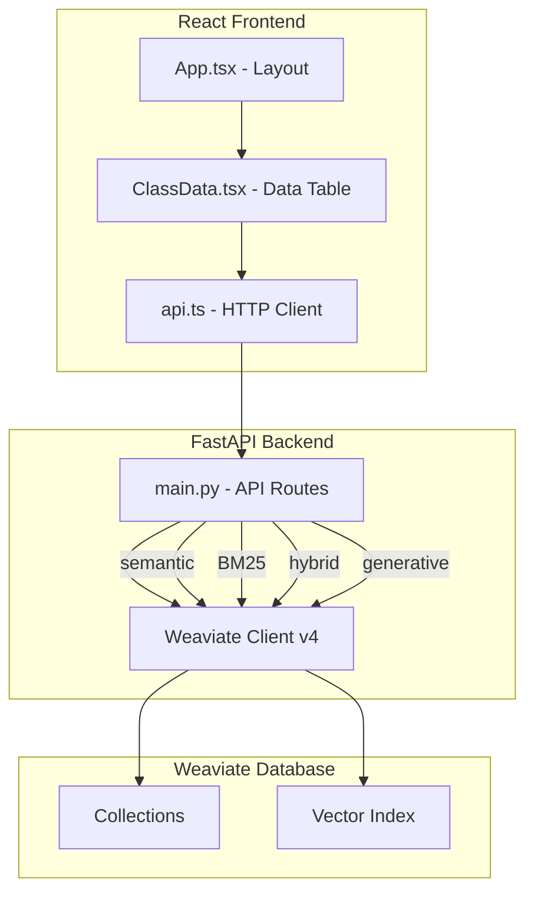

# Weaviate Spy Refactoring Plan v0.2.0

## Overview

This document outlines the refactoring plan for the Weaviate Spy project to leverage Weaviate Client v4 features and improve the user interface for better usability with large datasets.

## Current State Analysis

### Backend Issues
1. **Deprecated v3 API file**: [`weaviate_spy/weaviate_client.py`](weaviate_spy/weaviate_client.py) uses the old v3 client API
2. **Limited search options**: Only semantic search (near_text) is available
3. **No generative/RAG support**: Missing v4's generative capabilities
4. **Basic error handling**: No graceful handling for connection failures

### Frontend Issues
1. **No scrollbars**: Tables with many fields overflow without scroll capability
2. **Fixed column widths**: `ellipsis: true` truncates content without ability to expand
3. **Not responsive**: Layout doesn't adapt to screen size or field count
4. **Single search mode**: Only semantic search available

---

## Backend Refactoring

### 1. Remove Deprecated Code
**File**: [`weaviate_spy/weaviate_client.py`](weaviate_spy/weaviate_client.py)

This file uses the deprecated v3 API and should be removed. The v4 client is already properly initialized in [`weaviate_spy/main.py`](weaviate_spy/main.py).

### 2. Add Hybrid Search Support
**File**: [`weaviate_spy/main.py`](weaviate_spy/main.py)

Weaviate v4 supports hybrid search combining BM25 (keyword) and vector (semantic) search:

```python
@app.post("/class/{class_name}/hybrid")
def hybrid_search(
    class_name: str,
    query: str,
    alpha: float = 0.5,  # Balance between BM25 (0) and vector (1)
    limit: int = 20,
    offset: int = 0,
):
    collection = client.collections.get(class_name)
    response = collection.query.hybrid(
        query=query,
        alpha=alpha,
        limit=limit,
        offset=offset,
        return_metadata=["score", "explain_score"]
    )
    return {"data": response.objects}
```

### 3. Add BM25 (Keyword) Search
**File**: [`weaviate_spy/main.py`](weaviate_spy/main.py)

```python
@app.post("/class/{class_name}/bm25")
def bm25_search(
    class_name: str,
    query: str,
    limit: int = 20,
    offset: int = 0,
):
    collection = client.collections.get(class_name)
    response = collection.query.bm25(
        query=query,
        limit=limit,
        offset=offset,
        return_metadata=["score"]
    )
    return {"data": response.objects}
```

### 4. Add Generative/RAG Endpoints
**File**: [`weaviate_spy/main.py`](weaviate_spy/main.py)

```python
@app.post("/class/{class_name}/generate")
def generative_search(
    class_name: str,
    prompt: str,
    query: str | None = None,
    limit: int = 10,
):
    collection = client.collections.get(class_name)
    
    if query:
        # Generative search with semantic query
        response = collection.generate.near_text(
            query=query,
            single_prompt=prompt,
            limit=limit,
        )
    else:
        # Generative search over all objects
        response = collection.generate.fetch_objects(
            single_prompt=prompt,
            limit=limit,
        )
    
    return {"data": response.objects}
```

### 5. Add Aggregation Endpoints
**File**: [`weaviate_spy/main.py`](weaviate_spy/main.py)

```python
@app.get("/class/{class_name}/aggregate")
def aggregate(
    class_name: str,
    group_by: str | None = None,
):
    collection = client.collections.get(class_name)
    
    if group_by:
        response = collection.aggregate.over_all(
            group_by=group_by,
            return_metrics=["count"]
        )
    else:
        response = collection.aggregate.over_all(
            total_count=True
        )
    
    return {"data": response}
```

### 6. Improve Connection Management
**File**: [`weaviate_spy/main.py`](weaviate_spy/main.py)

- Add connection health check endpoint
- Implement graceful shutdown
- Add connection retry logic

```python
@app.on_event("startup")
async def startup_event():
    # Verify connection
    try:
        client.collections.list_all()
        logger.info("Connected to Weaviate successfully")
    except Exception as e:
        logger.error(f"Failed to connect to Weaviate: {e}")

@app.on_event("shutdown")
async def shutdown_event():
    client.close()
    logger.info("Weaviate connection closed")

@app.get("/health")
def health_check():
    try:
        client.collections.list_all()
        return {"status": "healthy"}
    except Exception as e:
        return {"status": "unhealthy", "error": str(e)}
```

---

## Frontend Refactoring

### 1. Fix Scrollbars for Large Datasets
**File**: [`frontend/src/ClassData.tsx`](frontend/src/ClassData.tsx)

Wrap ProTable in a scrollable container:

```tsx
<div style={{ 
  height: 'calc(100vh - 200px)', 
  overflow: 'auto' 
}}>
  <ProTable
    scroll={{ x: 'max-content', y: 'calc(100vh - 300px)' }}
    pagination={{
      showSizeChanger: true,
      showQuickJumper: true,
      defaultPageSize: 20,
      pageSizeOptions: ['10', '20', '50', '100'],
    }}
    ...
  />
</div>
```

### 2. Make Column Widths Adjustable
**File**: [`frontend/src/ClassData.tsx`](frontend/src/ClassData.tsx)

Add resizable columns using antd's resizable feature:

```tsx
import { Resizable } from 'react-resizable';

const ResizableTitle = (props) => {
  const { onResize, width, ...restProps } = props;
  
  if (!width) {
    return <th {...restProps} />;
  }

  return (
    <Resizable
      width={width}
      height={0}
      handle={
        <span
          className="react-resizable-handle"
          style={{
            position: 'absolute',
            right: -5,
            bottom: 0,
            width: 10,
            height: '100%',
            cursor: 'col-resize',
            zIndex: 1,
          }}
          onClick={(e) => e.stopPropagation()}
        />
      }
      onResize={onResize}
      draggableOpts={{ enableUserSelectHack: false }}
    >
      <th {...restProps} />
    </Resizable>
  );
};
```

### 3. Add Expandable Rows for Long Content
**File**: [`frontend/src/ClassData.tsx`](frontend/src/ClassData.tsx)

```tsx
<ProTable
  expandable={{
    expandedRowRender: (record) => (
      <div style={{ padding: '12px' }}>
        {Object.entries(record)
          .filter(([key]) => key !== 'key' && key !== 'index')
          .map(([key, value]) => (
            <div key={key} style={{ marginBottom: '8px' }}>
              <strong>{key}:</strong> {String(value)}
            </div>
          ))}
      </div>
    ),
    rowExpandable: (record) => 
      Object.values(record).some(v => 
        typeof v === 'string' && v.length > 50
      ),
  }}
  ...
/>
```

### 4. Add Search Mode Selector
**File**: [`frontend/src/ClassData.tsx`](frontend/src/ClassData.tsx)

Add a search mode selector with options:
- Semantic (near_text)
- Keyword (BM25)
- Hybrid (combined)

```tsx
const [searchMode, setSearchMode] = useState<'semantic' | 'keyword' | 'hybrid'>('semantic');
const [alpha, setAlpha] = useState(0.5); // For hybrid search

<Radio.Group 
  value={searchMode} 
  onChange={(e) => setSearchMode(e.target.value)}
  style={{ marginBottom: 16 }}
>
  <Radio.Button value="semantic">Semantic</Radio.Button>
  <Radio.Button value="keyword">Keyword</Radio.Button>
  <Radio.Button value="hybrid">Hybrid</Radio.Button>
</Radio.Group>

{searchMode === 'hybrid' && (
  <Slider
    min={0}
    max={1}
    step={0.1}
    value={alpha}
    onChange={setAlpha}
    marks={{
      0: 'BM25',
      0.5: 'Balanced',
      1: 'Vector'
    }}
  />
)}
```

### 5. Responsive Column Calculation
**File**: [`frontend/src/ClassData.tsx`](frontend/src/ClassData.tsx)

Dynamically adjust column widths based on number of properties:

```tsx
const calculateColumnWidth = (propertyName: string, totalProperties: number) => {
  const screenWidth = window.innerWidth;
  const availableWidth = screenWidth - 200; // Account for sidebar, etc.
  const minColumnWidth = 100;
  const maxColumnWidth = 300;
  
  // Calculate base width
  let baseWidth = Math.floor(availableWidth / totalProperties);
  
  // Clamp to min/max
  baseWidth = Math.max(minColumnWidth, Math.min(maxColumnWidth, baseWidth));
  
  // Adjust for property name length
  const nameWidth = propertyName.length * 8;
  return Math.max(baseWidth, nameWidth);
};
```

### 6. Update Types for New Features
**File**: [`frontend/src/types.ts`](frontend/src/types.ts)

Add types for search modes and new response structures:

```typescript
type SearchMode = 'semantic' | 'keyword' | 'hybrid';

interface SearchParams {
  mode: SearchMode;
  query: string;
  certainty?: number;  // For semantic
  alpha?: number;      // For hybrid
  limit: number;
  offset: number;
}

interface GenerativeResponse {
  uuid: string;
  properties: Record<string, any>;
  generated: string;
  metadata?: {
    score?: number;
    certainty?: number;
    distance?: number;
  };
}
```

---

## API Endpoint Summary

| Endpoint | Method | Description |
|----------|--------|-------------|
| `/schema` | GET | List all collections |
| `/class/{name}` | POST | Fetch objects with optional semantic search |
| `/class/{name}/bm25` | POST | BM25 keyword search |
| `/class/{name}/hybrid` | POST | Hybrid search (BM25 + vector) |
| `/class/{name}/generate` | POST | Generative/RAG search |
| `/class/{name}/aggregate` | GET | Aggregation analytics |
| `/health` | GET | Connection health check |

---

## Implementation Order

1. **Backend cleanup**: Remove deprecated `weaviate_client.py`
2. **Backend features**: Add new search endpoints
3. **Frontend scroll**: Fix overflow issues
4. **Frontend columns**: Add resizable columns
5. **Frontend search**: Add search mode selector
6. **Frontend responsive**: Add responsive layout
7. **Testing**: Verify all features work together

---

## Mermaid Diagram: System Architecture



---

## Mermaid Diagram: Search Flow

```mermaid
sequenceDiagram
    participant User
    participant Frontend
    participant Backend
    participant Weaviate
    
    User->>Frontend: Enter search query
    Frontend->>Frontend: Select search mode
    
    alt Semantic Search
        Frontend->>Backend: POST /class/name with near_text
        Backend->>Weaviate: near_text query
    else Keyword Search
        Frontend->>Backend: POST /class/name/bm25
        Backend->>Weaviate: bm25 query
    else Hybrid Search
        Frontend->>Backend: POST /class/name/hybrid with alpha
        Backend->>Weaviate: hybrid query
    end
    
    Weaviate-->>Backend: Results with metadata
    Backend-->>Frontend: JSON response
    Frontend-->>User: Display in scrollable table